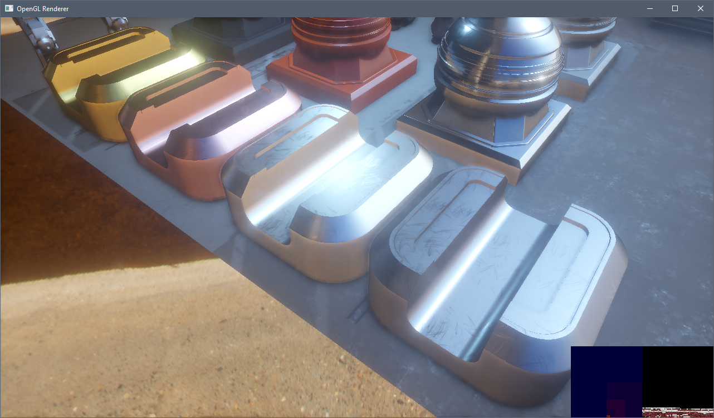
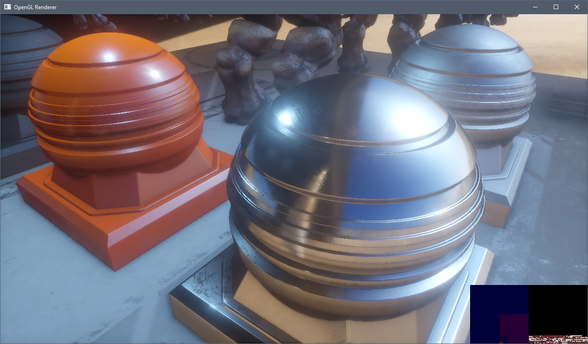
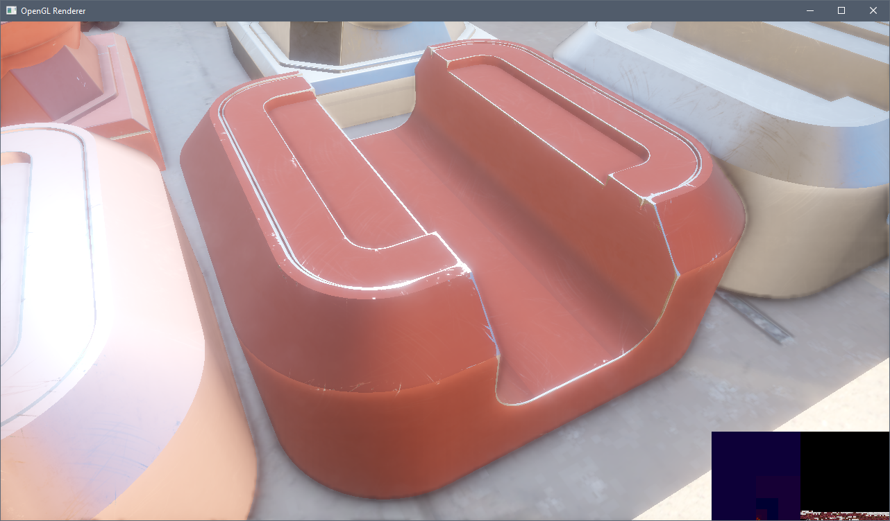
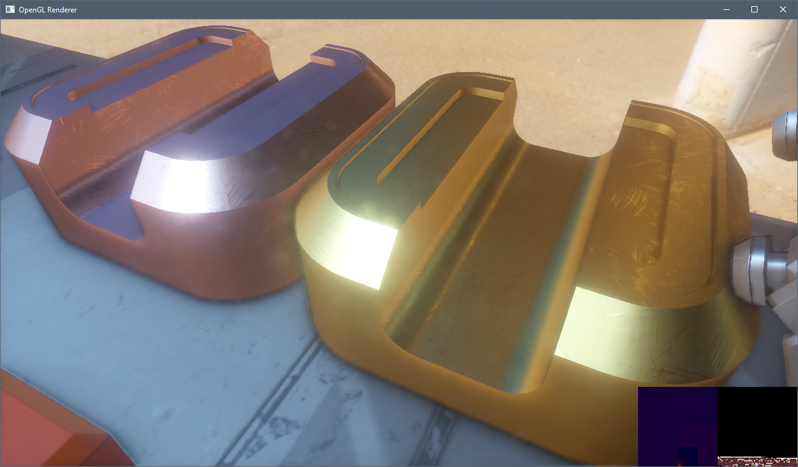

# OpenGL-Renderer
Experimental renderer

## Overview
This renderer was inspired by DOOM 2016 and I wrote it purely to experiment with modern rendering techniques. It is far 
from complete in any sense.

## Features
1. Sparse Virtual Texturing
2. Forward Clustered Lighting
3. HDR & Linear Correct Workflow
4. Analytical & Image Based PBR
6. Spherical Harmonics for diffuse irradiance
5. Post processing: SSAO & Bloom with lens dirt
6. Shader Hot Loading

## Screenshots

## License
**NOTE: The file '/Bin/models/Baron.obj' has been extracted from DOOM 2016, this is purely for educational purposes only.
Please do not distribute or re-use the model in your own projects. The rest of the assets have been created by myself or
are in the public domain.**

**Unlicense (http://unlicense.org) **

This is free and unencumbered software released into the public domain.

Anyone is free to copy, modify, publish, use, compile, sell, or
distribute this software, either in source code form or as a compiled
binary, for any purpose, commercial or non-commercial, and by any
means.

In jurisdictions that recognize copyright laws, the author or authors
of this software dedicate any and all copyright interest in the
software to the public domain. We make this dedication for the benefit
of the public at large and to the detriment of our heirs and
successors. We intend this dedication to be an overt act of
relinquishment in perpetuity of all present and future rights to this
software under copyright law.

THE SOFTWARE IS PROVIDED "AS IS", WITHOUT WARRANTY OF ANY KIND,
EXPRESS OR IMPLIED, INCLUDING BUT NOT LIMITED TO THE WARRANTIES OF
MERCHANTABILITY, FITNESS FOR A PARTICULAR PURPOSE AND NONINFRINGEMENT.
IN NO EVENT SHALL THE AUTHORS BE LIABLE FOR ANY CLAIM, DAMAGES OR
OTHER LIABILITY, WHETHER IN AN ACTION OF CONTRACT, TORT OR OTHERWISE,
ARISING FROM, OUT OF OR IN CONNECTION WITH THE SOFTWARE OR THE USE OR
OTHER DEALINGS IN THE SOFTWARE.

For more information, please refer to <http://unlicense.org>
